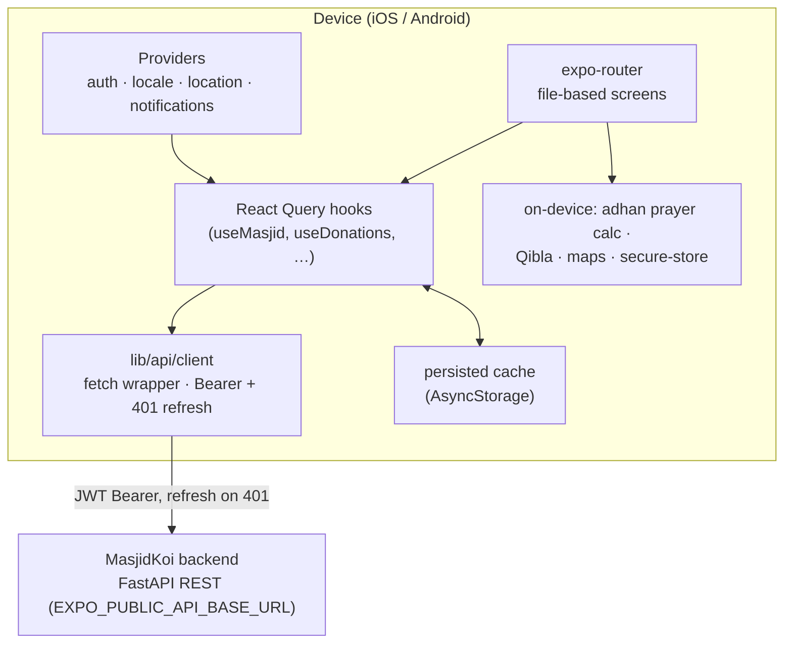

# MasjidKoi — Mobile App

MasjidKoi connects Muslims with their local masjids. It brings prayer times, masjid
discovery, donations, community, and gamified worship tracking together in one app —
built with Expo and React Native for iOS and Android.

## What it does

**Prayer & home**
- Daily prayer times computed on-device with [adhan](https://github.com/batoulapps/adhan-js), with a live next-prayer countdown
- Home dashboard, Qibla direction, Hijri calendar, and selectable azan sounds

**Discover**
- Explore nearby masjids on an interactive map, search and filter, and open directions in the native maps app
- City picker and location-based ranking

**Masjids**
- Rich masjid profiles with photos, facilities, and contribution flows
- Community-driven "add a masjid" submissions and photo contributions
- Ask-the-masjid Q&A and geofenced check-ins

**Community**
- Activity feed, follow masjids, events with RSVP, and masjid reviews & ratings

**Donations**
- One-time and recurring donations, campaigns, secure checkout, and downloadable receipts
- Personal donations dashboard and annual statements

**Gamification**
- Prayer journal, streaks, badges, goals, milestones, reflections, and gentle nudges

**Personal & accessibility**
- Passwordless email-OTP sign-in
- Appearance/theme controls, multi-language (English, Bengali, Arabic) with full RTL support
- Push notifications, exempt mode, and full account data export / deletion

## Tech stack

- **Expo** SDK 54 · **React Native** 0.81 · **React** 19
- **expo-router** — file-based navigation
- **NativeWind v4** (Tailwind CSS) for styling
- **TanStack React Query** with AsyncStorage persistence for server state
- **react-hook-form** + **zod** for forms and validation
- **i18next / react-i18next** + **expo-localization** (en / bn / ar, RTL-aware)
- **react-native-maps** + **expo-location** for discovery
- **expo-notifications**, **expo-audio**, **expo-image**, **expo-secure-store**
- Hind Siliguri font for Bengali typography

The app talks to the **MasjidKoi backend** (FastAPI) over a REST API.

## Architecture



- **Data layer** — feature hooks in `hooks/` wrap **TanStack React Query**;
  results persist to **AsyncStorage** so the app opens with warm data offline.
- **API client** — `lib/api/client.ts` is a typed `fetch` wrapper that attaches
  the JWT `Bearer` token, refreshes it on a `401`, and drops to the login gate if
  refresh fails. The backend mounts routers at **root** — there is **no `/api/v1`
  prefix**.
- **Auth** — passwordless email-OTP; access/refresh tokens are stored via
  `expo-secure-store` (`lib/auth/`).
- **On-device compute** — prayer times (`adhan`), Qibla, and Hijri dates are
  calculated locally; the deep-link scheme is `masjidkoi://`.

## Getting started

Prerequisites: **Node.js 20+**, npm, and the [Expo](https://docs.expo.dev)
toolchain. For native builds you'll also need Xcode (iOS) and/or Android Studio.

```bash
# 1. Install dependencies
npm install

# 2. Point the app at your backend API
cp .env.example .env.local     # then edit EXPO_PUBLIC_API_BASE_URL

# 3. Start the dev server
npx expo start
```

From the Expo dev server you can launch the app in:

- an iOS simulator — `npm run ios`
- an Android emulator — `npm run android`
- a physical device via [Expo Go](https://expo.dev/go)

### Configuration

Runtime config resolves in `config/env.ts` in this order: `EXPO_PUBLIC_*` env
vars → `app.json` → `expo.extra` → hardcoded defaults.

| Variable | Description |
|---|---|
| `EXPO_PUBLIC_API_BASE_URL` | Backend base URL (**no** version prefix). Simulator/emulator: `http://localhost:8001`. Physical device: your LAN IP or an Expo tunnel URL. |
| `EXPO_PUBLIC_APP_ENV` | `development` \| `staging` \| `production` |
| `EXPO_PUBLIC_GOOGLE_MAPS_ANDROID_KEY` | Google Maps key for Android map screens (optional) |

> `localhost` only works in a simulator/emulator — a physical device must reach
> the backend over a LAN IP or tunnel. The committed `app.json` default
> (`expo.extra.apiBaseUrl`) points at `https://api.masjidkoi.me`; override it with
> `.env.local` for local development.

## Project structure

```
app/                 # screens & routes (expo-router, file-based, typed routes)
  (app)/(tabs)/      # main tabs: home, explore, feed, profile
  (app)/             # feature screens: donate, donation, campaign, event,
                     # badges, journal, goals, checkin, masjid, review, receipt…
components/          # shared UI components
hooks/               # ~55 React Query data hooks (useMasjid, useDonations, …)
providers/           # app providers: auth, locale, location, notifications, nudges
config/              # env.ts — typed runtime config resolution
lib/                 # api client + feature modules:
                     #   api/ auth/ donations/ masjids/ prayer/ qibla/ hijri/
                     #   i18n/ query/ location/ notifications/ forms/ theme/ …
constants/           # static app constants
assets/              # fonts, images, azan audio
```

## Scripts

| Command | Description |
|---|---|
| `npm start` | Start the Expo dev server |
| `npm run ios` | Run on the iOS simulator |
| `npm run android` | Run on the Android emulator |
| `npm run web` | Run in the browser |
| `npm run lint` | Lint the project |
| `npm test` | Run the Jest test suite |

## Localization

UI strings live in `lib/i18n/locales/{en,bn,ar}.json`. Arabic enables right-to-left
layout automatically. Bengali numerals and Hijri dates are supported throughout.

## Building & releasing

The app uses the Expo **new architecture** (`newArchEnabled: true`) and the React
Compiler. Native identifiers: iOS bundle `com.anonymous.mobile`, Android package
`com.anonymous.mobile`, URL scheme `masjidkoi://`.

Local native builds (compile on your machine — needs Xcode / Android Studio):

```bash
npm run ios          # build & run on iOS simulator
npm run android      # build & run on Android emulator
```

Cloud / distribution builds via [EAS](https://docs.expo.dev/build/introduction/):

```bash
npm install -g eas-cli
eas login
eas build --platform ios          # or android / all
eas submit --platform ios         # upload to App Store / Play Console
```

Set `EXPO_PUBLIC_API_BASE_URL` / `EXPO_PUBLIC_APP_ENV` (and the maps key) as EAS
build-time environment variables — they are inlined into the JS bundle at build
time, so a release build must point at the production backend
(`https://api.masjidkoi.me`). OTA JS updates ship through **expo-updates**.

The permission strings and notification sounds (`azan_mecca`, `azan_madina`) are
declared in `app.json` — update them there, not in native project files.

---

Built as part of the Internet Programming lab project.
